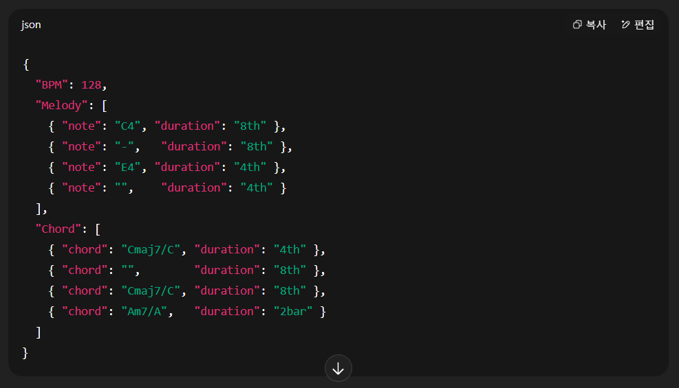

# Music Token Format – HarmonyMIDIToken Specification

# 적용범위

이 표준은 ISLAND IDs에서 제작 예정인 HarmonyMIDIToken에 적용된다.

## HarmonyMIDIToken

HarmonyMIDIToken은 AI Agent DIVA의 Melody Generate Tool의 Tokenizer 이름이며, pitch에 따른 Instrument 구분이 완료된 Future Bounce[3.2] Midi 파일을 음향학적으로 나타낼 수 있다.

Pitch에 따른 Instrument 구분은 C#6 이상의 음은 멜로디, C5이상 C#6미만의 음은 코드, C5미만의 음은 베이스로 구분하는 것을 의미한다. (이에 대한 내용은 절 제목 참조)

해당 Tokenizer는 Python으로 작성되며, Music21을 기반으로 작성한다.

# 인용표준

There is no normative reference in this document.

이 문서에는 인용표준이 존재하지 않는다.

# 용어와 정의

이 표준의 목적을 위하여 다음의 용어와 정의를 적용한다.

### 3.1 ISLAND IDs

> ISLAND
> 
- Future Bounce[3.2], Bass House[3.3], Future Bass[3.4], SoundMad[3.5] ID[3.6]를 홍보하는 SoundCloud 채널이자, 음악과 관련된 소프트웨어를 제작하는 GitHub 조직

### 3.2 Future Bounce

- EDM 하위 장르

### 3.3 Bass House

- EDM 하위 장르

### 3.4 Future Bass

- EDM 하위 장르

### 3.4 SoundMad

> 음매드
> 
- 사람의 목소리, 대중교통 소리 등을 합성(샘플링)하여 기존에 존재하던 음악을 커버하는 장르

### 3.4 ID

> 183
> 
- 미완성 작품

# Input Midi 파일의 기준

기본적으로 Future Bounce의 멜로디, 코드, 베이스 음을 한 파일안에 전부 포함하고 있어야 하며, 아래의 기준을 충족해야 한다.

## 악기의 구분

악기는 멜로디(리드), 코드, 베이스 로 구성되며, Pitch(음정)의 높낮이에 따라 악기를 구분한다.

베이스는 저음 역대를 담당해야 하므로 제일 낮은 Pitch를 가져야 하며, 멜로디는 상대적으로 잘 들리는 고음 역대에 위치해야 한다.

그러므로 C#6 이상의 음은 멜로디, C5이상 C#6미만의 음은 코드, C5미만의 음은 베이스로 구분해야 하며, 이를 준수하지 못하면 Tokenizer에 의도치 않은 오류가 발생할 수 있다.

## 코드, 베이스 리듬

코드와 베이스는 리듬성을 띄어야 한다.

단순히 한 마디동안 같은 음을 계속 누르는 것이 아니라, 각각의 리듬성을 가지고 연주되어야 한다.

이 리듬성은 실제 Future Bounce에서의 코드, 베이스 리듬과 일치해야 하며, 멜로디의 리듬을 따를 필요는 없다.

베이스와 코드의 리듬은 서로 같은 것을 원칙으로 하지만, 아닌 경우도 사용할 수 있다.

## 파일의 음악성

Midi파일을 그냥 실행 (기본 악기, 피아노 등으로 재생)해도 음악성을 띄고 있어야 한다.

## 파일의 타입

기본적으로 Tokenizer는 Music21을 기반으로 작성될 예정이므로, Music21의 타입을 가지고 있어야 한다.

또한 내부적으로 기본 Python 파일 타입을 받게 되면 자동으로 Music21의 타입으로 변경 가능하니 Python 기본 타입도 지원한다고 볼 수 있다.

# Output 파일

Tokenizer를 사용하여 Midi 파일을 Token화 시킬 경우, 아래와 같은 조항에 따라 값을 return한다.

## Output 타입

Return되는 객체의 타입은 기본적으로 커스텀 Midi 객체이다.

하지만 내장 메서드로 JSON 형태로 변경할 수 있으며, 변경될 JSON형태는 5.1.1조항을 따른다.

또한 객체의 메서드는 5.1.2 조항을 따른다.

### JSON 구조

HarmonyMIDIToken의 JSON 구조는 크게 3개의 Key(BPM, Melody, Chord)로 구성되며, 각 Key에 대한 세부 설명은 아래와 같다.

### BPM Key

첫 번째 Key는 BPM으로, Midi 파일의 전체적인 속도를 결정한다.

기본적으로 128BPM이지만, 130BPM, 126BPM, 혹은 140BPM등의 다양한 값을 가질 수 있다.

이는 이후 duration 값을 시간으로 환산하는 기준이 된다.

### Melody Key

Melody는 멜로디 라인을 List 형태로 저장하며, 각 항목은 개별 음에 대한 정보를 담은 딕셔너리로 구성된다.

각 딕셔너리는 다음의 속성을 가진다:

note: 음 이름 (예: "C4", "D#5", "A3" 등)

duration: 해당 음의 길이 (예: "4th", "8th", "16th" 등)

만약 해당 시점에 멜로디가 없을 경우, note는 빈 문자열 ""로 처리한다.

직전 음과 동일한 음이 반복될 경우, note에 "-"를 입력해 반복을 나타낼 수 있다. 단, 동일한 음이더라도 의미상 새로운 음이라면 반복 기호를 사용하지 않고 다시 명시해야 한다. (이에 대해 자세한 점은 A.1를 참고)

### Chord Key

Chord는 코드 및 베이스 라인을 List 형태로 저장하며, 멜로디와 동일하게 각 항목은 딕셔너리 구조를 따른다.

각 딕셔너리는 다음의 속성을 가진다:

- chord: 코드/베이스 형식의 문자열 (예: "Cmaj7/G", "C#m/C#", "Dsus4/D" 등)
- duration: 해당 코드가 유지되는 길이 (예: "1bar", "4th", "8th" 등)

베이스 노트가 코드의 루트와 같더라도 반드시 ‘/’ 뒤에 베이스 노트를 명시해야 한다.

(예: "C/C", "F#m/F#")

해당 시점에 코드가 없을 경우 chord는 빈 문자열 ""로 처리한다.

직전 코드와 동일한 코드가 반복될 경우 "-"를 입력하여 반복을 표현할 수 있다. 단, 동일한 음이더라도 의미상 새로운 음이라면 반복 기호를 사용하지 않고 다시 명시해야 한다. (이에 대해 자세한 점은A.1 를 참고)

## 메서드 종류

해당 객체에 존재하는 메서드는 아래 조항을 따른다

### ‘to_json’ 메서드

JSON으로 변환이 가능한 딕셔너리 객체를 return한다.

return하는 JSON 구조는 5.1.1를 따른다.

### ‘to_midi’ 메서드

객체를 midi파일을 담고있는 Byte객체로 변환하여 return한다.

### ‘set_midi’메서드

매개변수로 midi객체 혹은 파일 객체를 넣으면, 해당 midi파일을 담게 된다.

# 부속서 A (JSON 구조에 대하여)

## JSON 구조 예시

아래 사진 참고

